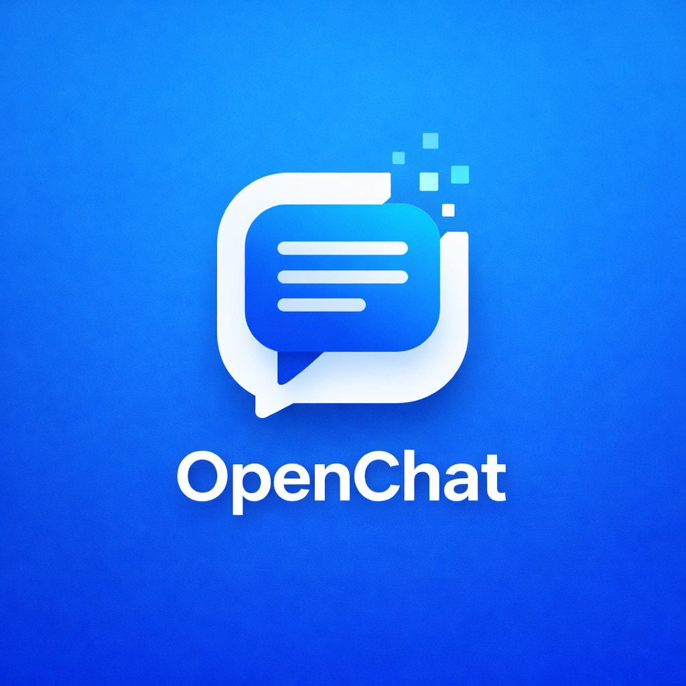

<div align="center">



# OpenChat

**Open Source Instant Messaging Platform**

[](https://opensource.org/licenses/MIT)
[](https://nodejs.org/)
[](https://www.typescriptlang.org/)
[](https://www.docker.com/)
[](https://nestjs.com/)

[English](README.md) | [中文](README_CN.md)

</div>

---

## 🚀 Quick Start

### Prerequisites

- Node.js 18+
- PostgreSQL 14+
- Redis 6+
- WukongIM Server

### Installation

```bash
# Clone the repository
git clone https://github.com/Sdkwork-Cloud/openchat.git
cd openchat

# Install dependencies
pnpm install
# or
npm install
# or
yarn install

# Configure environment variables
cp .env.example .env

# Run database migrations
pnpm run migration:run

# Start the server in development mode
pnpm run start:dev

# Build for production
pnpm run build
# Start in production mode
pnpm run start:prod
```

### Docker Deployment (Recommended)

```bash
docker-compose up -d
```

## 📋 Table of Contents

- [🚀 Quick Start](#-quick-start)
- [📋 Table of Contents](#-table-of-contents)
- [✨ Features](#-features)
- [📁 Architecture](#-architecture)
- [🔧 Technology Stack](#-technology-stack)
- [📚 API Documentation](#-api-documentation)
- [🏗️ Project Structure](#️-project-structure)
- [🌐 Integration](#-integration)
- [⚡ Performance Optimization](#-performance-optimization)
- [🔒 Security](#-security)
- [📊 Monitoring & Logging](#-monitoring--logging)
- [📦 Deployment](#-deployment)
- [👨‍💻 Development Guide](#-development-guide)
- [❓ Troubleshooting](#-troubleshooting)
- [🤝 Contributing](#-contributing)
- [📄 License](#-license)
- [💬 Community](#-community)
- [📷 Screenshots](#-screenshots)

## ✨ Features

### 📱 Core Messaging
- ✅ One-to-one chat
- ✅ Group chat with up to 50 members
- ✅ Message history and search
- ✅ Message recall and read receipts
- ✅ Support for text, images, voice, video, and files
- ✅ Offline message push

### 🔊 Real-time Audio/Video
- ✅ HD audio/video calls
- ✅ Screen sharing
- ✅ Group calls

### 🤖 AI Assistant
- ✅ Built-in GPT support
- ✅ Intelligent customer service
- ✅ Custom AI bots

### 🔌 Third-party Integration
- ✅ Telegram, WhatsApp message sync
- ✅ Webhook support
- ✅ Rich API interfaces

### 🛠️ System Features
- ✅ User management (registration, login, profile)
- ✅ Friend system (requests, management)
- ✅ Group system (creation, member management)
- ✅ WebSocket real-time message push
- ✅ Distributed deployment support
- ✅ Performance monitoring and logging
- ✅ Security authentication and authorization
- ✅ Rate limiting

## 📁 Architecture

```
┌─────────────────────────────────────────────────────────────┐
│                         Client Layer                         │
├──────────────┬──────────────┬──────────────┬────────────────┤
│   Web App    │  PC Client   │  Mobile App  │  Mini Program  │
└──────┬───────┴──────┬───────┴──────┬───────┴────────┬───────┘
       │              │              │                │
       └──────────────┴──────────────┴────────────────┘
                           │
┌──────────────────────────┼───────────────────────────────────┐
│                      Service Layer (NestJS)                          │
│  ┌──────────┬──────────┬──────────┬──────────┬─────────────┐  │
│  │   Auth   │   User   │ Message  │  Group   │    RTC      │  │
│  └──────────┴──────────┴──────────┴──────────┴─────────────┘  │
└──────────────────────────┬───────────────────────────────────┘
                           │
┌──────────────────────────┼───────────────────────────────────┐
│                      Message Layer (WukongIM)                          │
└──────────────────────────┬───────────────────────────────────┘
                           │
┌──────────────────────────┼───────────────────────────────────┐
│                       Data Layer                                 │
│  ┌──────────────┬──────────────┬──────────────┬───────────┐  │
│  │  PostgreSQL  │    Redis     │    MinIO     │  ES       │  │
│  └──────────────┴──────────────┴──────────────┴───────────┘  │
└───────────────────────────────────────────────────────────────┘
```

## 🔧 Technology Stack

### Backend
- **Framework**: [NestJS](https://nestjs.com/) 11.x + TypeScript
- **ORM**: [TypeORM](https://typeorm.io/) 0.3.x
- **Database**: [PostgreSQL](https://www.postgresql.org/) 15+
- **Cache**: [Redis](https://redis.io/) 7+
- **Message Queue**: [BullMQ](https://docs.bullmq.io/)
- **WebSocket**: [Socket.IO](https://socket.io/)
- **Authentication**: JWT
- **IM Engine**: [WukongIM](https://githubim.com/)

### Frontend (Optional)
- **Framework**: [React](https://react.dev/) 18.x
- **State Management**: [Zustand](https://github.com/pmndrs/zustand)
- **Styling**: [Tailwind CSS](https://tailwindcss.com/)

## 📚 API Documentation

### Swagger UI

Start the server and navigate to:

```
http://localhost:3000/api/docs
```

### API Endpoints

- **Authentication**: `/api/auth/*`
- **Users**: `/api/users/*`
- **Messages**: `/api/messages/*`
- **Groups**: `/api/groups/*`
- **Contacts**: `/api/contacts/*`
- **RTC**: `/api/rtc/*`

## 🏗️ Project Structure

```
openchat/
├── src/                 # Source code
│   ├── common/          # Common modules
│   │   ├── auth/        # Authentication
│   │   ├── cache/       # Caching
│   │   ├── config/      # Configuration
│   │   ├── filters/     # Exception filters
│   │   ├── health/       # Health check
│   │   ├── metrics/      # Performance monitoring
│   │   ├── queue/        # Message queue
│   │   ├── redis/        # Redis integration
│   │   └── throttler/    # Rate limiting
│   ├── gateways/        # WebSocket gateways
│   ├── modules/         # Business modules
│   │   ├── ai-bot/       # AI bots
│   │   ├── bot-platform/ # Bot platform
│   │   ├── contact/      # Contacts
│   │   ├── conversation/ # Conversations
│   │   ├── friend/        # Friends
│   │   ├── group/          # Groups
│   │   ├── im-provider/   # IM providers
│   │   ├── message/        # Messages
│   │   ├── rtc/             # Real-time communication
│   │   ├── third-party/    # Third-party integrations
│   │   └── user/            # Users
│   ├── app.module.ts      # Application module
│   ├── main.ts            # Application entry
│   └── typings/           # Type definitions
├── docs/                 # Documentation
│   └── assets/            # Assets directory
│       ├── images/        # Image files
│       │   ├── branding/  # Branding images
│       │   │   ├── logo.png # Project logo
│       │   │   ├── favicon.ico # Browser icon
│       │   │   └── banner.png # Project banner
│       │   ├── screenshots/ # Screenshots
│       │   │   ├── web/    # Web interface screenshots
│       │   │   ├── mobile/ # Mobile interface screenshots
│       │   │   └── video/  # Video call screenshots
│       │   └── social/     # Social media images
│       │       ├── wechat-qr.png # WeChat Official Account QR code
│       │       └── banner.jpg # Social media banner
│       ├── videos/        # Video files
│       └── icons/         # Icon files
├── database/             # Database scripts
├── k8s/                  # Kubernetes configuration
├── docker-compose.yml     # Docker Compose configuration
└── README.md              # This file
```

## 🌐 Integration

### WukongIM Integration

OpenChat is deeply integrated with WukongIM for reliable and real-time messaging:

1. **Message Sending**: All messages are sent through WukongIM
2. **User Synchronization**: User data is kept consistent between local database and WukongIM
3. **Group Synchronization**: Group data is kept consistent between local database and WukongIM
4. **Message Confirmation**: Support for message delivery confirmation and read receipts

### Third-party Services

- **Telegram**: Message synchronization
- **WhatsApp**: Message synchronization
- **Webhook**: Custom integrations

## ⚡ Performance Optimization

- **Database Connection Pool**: Optimized pool size and timeout settings
- **Redis Caching**: Reduce database queries and improve performance
- **Batch Processing**: Support for batch message sending and processing
- **Message Queue**: Asynchronous processing of time-consuming operations
- **Exponential Backoff Retry**: Improve message sending reliability
- **Rate Limiting**: Prevent system overload

## 🔒 Security

- **JWT Authentication**: Secure user authentication mechanism
- **Multi-factor Authentication**: Support for multiple authentication methods
- **CORS Configuration**: Proper cross-origin resource sharing settings
- **Helmet Security Headers**: Enhance application security
- **Input Validation**: Prevent malicious input
- **Rate Limiting**: Prevent brute force attacks

## 📊 Monitoring & Logging

- **Performance Monitoring**: Real-time collection of system performance metrics
- **Log Recording**: Detailed system logs
- **WukongIM Monitoring**: Monitor message sending and processing
- **Health Check**: System health status check

## 📦 Deployment

### Containerization

```bash
# Build Docker image
docker build -t openchat/server:latest .

# Run container
docker run -d \
  --name openchat \
  -p 3000:3000 \
  -e NODE_ENV=production \
  -e DB_HOST=postgres \
  -e DB_PASSWORD=your-password \
  openchat/server:latest
```

### Kubernetes Deployment

```bash
# Deploy to Kubernetes
kubectl apply -k k8s/overlays/production
```

## 👨‍💻 Development Guide

### Code Style

- Use TypeScript strict mode
- Follow NestJS code style guidelines
- Use ESLint and Prettier for code quality

### Testing

```bash
# Run tests
pnpm run test

# Run test coverage
pnpm run test:cov
```

### Debugging

1. Start in development mode: `pnpm run start:dev`
2. Connect to debug port using VSCode or other IDE

## ❓ Troubleshooting

### WukongIM Connection Issues

1. Check if WukongIM server is running
2. Verify `WUKONGIM_API_URL` configuration
3. Check network connectivity

### Database Connection Issues

1. Ensure PostgreSQL service is running
2. Verify database configuration
3. Check database user permissions

### WebSocket Connection Issues

1. Check if Redis service is running
2. Verify WebSocket port is open
3. Check authentication token validity

## 🤝 Contributing

We welcome contributions from the community!

### Steps to Contribute

1. Fork the repository
2. Create a feature branch
3. Commit your changes
4. Push to the branch
5. Create a Pull Request

### Code of Conduct

Please read our [Code of Conduct](CODE_OF_CONDUCT.md) before contributing.

## 📄 License

OpenChat is open source software licensed under the [MIT License](LICENSE).

## 💬 Community

Join our community to get help, share ideas, and contribute to the project!

| Platform | Link |
|----------|------|
| GitHub Discussions | [](https://github.com/Sdkwork-Cloud/openchat/discussions) |
| X (Twitter) | [](https://x.com/openchat_cloud) |
| Discord | [](https://discord.gg/openchat) |
| WeChat Official Account | Scan the QR code below |
| Email | [](mailto:contact@sdkwork.com) |

<div align="center">
  
  <p>OpenChat Official Account</p>
</div>

## 📷 Screenshots

<div align="center">

### Web Interface


### Mobile Interface


### Video Call


</div>

---

<div align="center">

**If you find this project helpful, please give us a ⭐ Star!**

</div>

<div align="center">

© 2024 Sdkwork Cloud. All rights reserved.

</div>