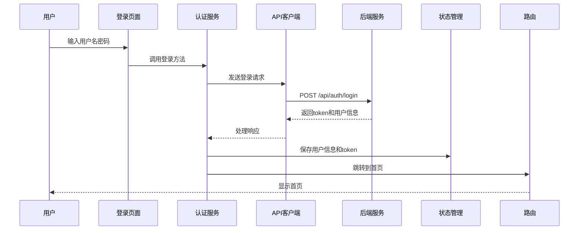
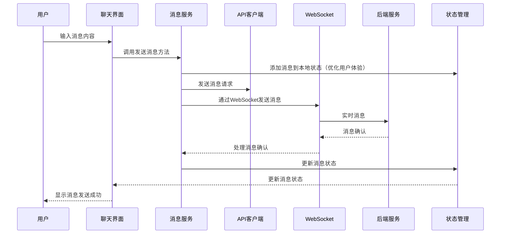

# React 技术架构标准文档

## 1. 架构标准概述

本文档定义了一套高度标准化、可复用的 React 项目技术架构，基于 OpenChat React PC 项目实践。该架构遵循软件工程的开闭原则，采用组件化设计，支持高度扩展和复用，可作为创建新 React 项目的标准模板。

### 1.1 核心设计理念

- **模块化**：清晰的模块划分，便于维护和扩展
- **组件化**：高度组件化的设计，提高代码复用性
- **类型安全**：充分利用 TypeScript 提供的类型系统
- **性能优化**：多种性能优化策略，提供流畅的用户体验
- **可扩展性**：设计合理的扩展点，支持功能扩展
- **跨平台**：支持 Web 和桌面平台
- **安全性**：多种安全措施，保护用户数据
- **可访问性**：考虑无障碍设计，提高应用的可用性

### 1.2 适用场景

- 现代化 React 单页应用（SPA）
- 跨平台桌面应用（基于 Tauri）
- 企业级应用
- 需要实时通信的应用（如即时通讯）
- 需要高度可扩展的应用

## 2. 技术栈选择

### 2.1 核心技术栈

| 技术 | 版本 | 用途 | 选型理由 |
|------|------|------|----------|
| React | 18+ | 前端框架 | 生态成熟，组件化开发，支持并发渲染和Suspense，提供优秀的开发体验 |
| TypeScript | 5+ | 类型系统 | 增强代码可维护性，提供类型安全，减少运行时错误，提升开发效率 |
| Vite | 5+ | 构建工具 | 快速的开发服务器，优化的构建输出，支持模块热替换和按需编译 |
| Tailwind CSS | 4+ | 样式库 | 实用优先的CSS框架，减少样式文件体积，支持原子化CSS和自定义主题 |
| Tauri | 2+ | 桌面应用框架 | 轻量级，性能优异，安全可靠，使用Rust作为后端，资源占用低 |
| React Router | 6+ | 路由管理 | 声明式路由，支持嵌套路由、路由守卫和代码分割，API简洁易用 |
| React Query | 5+ | 数据获取 | 强大的缓存管理，自动重试机制，实时数据同步，支持乐观更新 |
| Zustand | 4+ | 状态管理 | 轻量级，简洁API，无需模板代码，支持中间件和持久化 |

### 2.2 工具链与依赖

| 工具 | 用途 | 选型理由 |
|------|------|----------|
| ESLint | 代码检查 | 确保代码质量和一致性，支持自定义规则和插件 |
| Prettier | 代码格式化 | 统一代码风格，减少格式化争议，提高团队协作效率 |
| Vitest | 单元测试 | 快速的测试运行器，与Vite集成良好，支持TypeScript和ESM |
| Playwright | 端到端测试 | 现代化的E2E测试工具，支持多浏览器和并行测试 |
| Husky | Git钩子 | 在提交前执行检查，确保代码质量，防止错误代码提交 |
| Commitizen | 提交规范 | 标准化Git提交信息，便于版本管理和CHANGELOG生成 |
| PostCSS | CSS处理 | 支持现代CSS特性，与Tailwind CSS配合使用 |
| SWC | 代码编译 | 高性能的JavaScript/TypeScript编译器，替代Babel提升构建速度 |

### 2.3 网络与通信

| 技术 | 用途 | 选型理由 |
|------|------|----------|
| Axios | HTTP客户端 | 功能丰富的HTTP客户端，支持拦截器、取消请求和自动转换 |
| Socket.IO | WebSocket | 实时双向通信，支持降级策略和房间管理 |
| Service Worker | 离线支持 | 提供离线访问能力，缓存静态资源，提升用户体验 |

### 2.4 性能优化

| 技术 | 用途 | 选型理由 |
|------|------|----------|
| Web Worker | 后台计算 | 将 heavy 计算移至后台线程，避免阻塞主线程 |
| Virtual List | 长列表优化 | 虚拟滚动技术，只渲染可视区域内的列表项 |
| LRU Cache | 内存缓存 | 高效的内存缓存策略，优化数据访问性能 |
| WebAssembly | 高性能计算 | 用于计算密集型任务，如Markdown解析、数据处理等 |
| Code Splitting | 代码分割 | 按需加载代码，减少初始加载时间 |

## 3. 架构设计

### 3.1 核心架构原则

- **开闭原则**：对扩展开放，对修改关闭，通过抽象和接口实现功能扩展
- **高内聚低耦合**：模块内部高度内聚，模块之间低耦合，减少依赖关系
- **单一职责**：每个组件和模块只负责一项功能，提高代码可维护性
- **组件化设计**：将UI拆分为可复用的组件，提高代码复用率
- **数据驱动**：UI由数据状态驱动，而非命令式操作，简化状态管理
- **类型安全**：充分利用TypeScript提供的类型系统，减少运行时错误
- **可测试性**：设计易于测试的组件和模块，提高代码质量
- **可扩展性**：预留扩展点，支持功能的横向和纵向扩展

### 3.2 分层架构

采用清晰的分层架构，确保各层职责明确，便于维护和扩展：

```
┌─────────────────────────────────────────────────────────────────────┐
│                            表现层                                  │
│  ┌─────────────────┐  ┌─────────────────┐  ┌─────────────────┐      │
│  │    页面组件     │  │    布局组件     │  │    UI组件       │      │
│  └─────────────────┘  └─────────────────┘  └─────────────────┘      │
├─────────────────────────────────────────────────────────────────────┤
│                            业务层                                  │
│  ┌─────────────────┐  ┌─────────────────┐  ┌─────────────────┐      │
│  │    业务模块     │  │    业务服务     │  │    业务钩子     │      │
│  └─────────────────┘  └─────────────────┘  └─────────────────┘      │
├─────────────────────────────────────────────────────────────────────┤
│                            数据层                                  │
│  ┌─────────────────┐  ┌─────────────────┐  ┌─────────────────┐      │
│  │    API客户端    │  │    状态管理     │  │    数据存储     │      │
│  └─────────────────┘  └─────────────────┘  └─────────────────┘      │
├─────────────────────────────────────────────────────────────────────┤
│                          基础设施层                                │
│  ┌─────────────────┐  ┌─────────────────┐  ┌─────────────────┐      │
│  │    工具函数     │  │    类型定义     │  │    配置管理     │      │
│  └─────────────────┘  └─────────────────┘  └─────────────────┘      │
├─────────────────────────────────────────────────────────────────────┤
│                          平台抽象层                                │
│  ┌─────────────────┐  ┌─────────────────┐  ┌─────────────────┐      │
│  │  平台接口       │  │  Web实现       │  │  桌面实现       │      │
│  └─────────────────┘  └─────────────────┘  └─────────────────┘      │
└─────────────────────────────────────────────────────────────────────┘
```

### 3.3 层职责说明

| 层级 | 职责 | 核心组件 |
|------|------|----------|
| **表现层** | 负责UI渲染和用户交互 | 页面组件、布局组件、UI组件 |
| **业务层** | 负责业务逻辑处理 | 业务模块、业务服务、自定义钩子 |
| **数据层** | 负责数据获取、存储和管理 | API客户端、状态管理、本地存储 |
| **基础设施层** | 提供通用工具和配置 | 工具函数、类型定义、配置管理 |
| **平台抽象层** | 抽象不同平台的差异 | 平台接口、Web实现、桌面实现 |

### 3.3 核心流程图

#### 用户登录流程



#### 消息发送流程



## 4. 目录结构

### 4.1 标准目录结构

```
├── src/                      # 源代码目录
│   ├── app/                  # 应用核心
│   │   ├── App.tsx           # 应用根组件
│   │   ├── AppProvider.tsx   # 应用提供者
│   │   ├── QueryProvider.tsx # 数据查询提供者
│   │   └── env.ts            # 环境配置
│   ├── components/           # 通用组件
│   │   ├── AsyncComponent/   # 异步组件
│   │   ├── ErrorBoundary/    # 错误边界
│   │   ├── a11y/             # 无障碍组件
│   │   ├── desktop/           # 桌面端组件
│   │   │   ├── WindowControls/ # 窗口控制
│   │   │   └── Sidebar.tsx    # 侧边栏
│   │   ├── ui/               # UI组件
│   │   │   ├── Button/        # 按钮组件
│   │   │   ├── Input/         # 输入组件
│   │   │   ├── Modal.tsx      # 模态框
│   │   │   └── ...            # 其他UI组件
│   ├── contexts/             # 上下文
│   ├── hooks/                # 自定义钩子
│   ├── i18n/                 # 国际化
│   │   ├── locales/           # 语言包
│   │   └── index.ts           # 国际化配置
│   ├── layouts/              # 布局组件
│   ├── modules/               # 业务模块
│   │   ├── auth/              # 认证模块
│   │   ├── contacts/          # 联系人模块
│   │   ├── im/                # 即时通讯模块
│   │   ├── rtc/               # 实时音视频模块
│   │   ├── agent/             # 智能助手模块
│   │   └── terminal/          # 终端模块
│   ├── pages/                # 页面组件
│   ├── platform/              # 平台抽象接口
│   ├── platform-impl/         # 平台实现
│   │   ├── web/               # Web平台实现
│   │   └── desktop/           # 桌面平台实现
│   ├── router/                # 路由配置
│   │   ├── guards/            # 路由守卫
│   │   ├── routes.ts          # 路由定义
│   │   └── index.tsx          # 路由配置
│   ├── services/              # 服务
│   │   ├── api.client.ts      # API客户端
│   │   ├── websocket.client.ts # WebSocket客户端
│   │   └── ...                # 其他服务
│   ├── store/                 # 状态管理
│   ├── types/                 # 类型定义
│   ├── utils/                 # 工具函数
│   ├── workers/               # Web Worker
│   ├── main.tsx               # 应用入口
│   └── index.css              # 全局样式
├── public/                    # 静态资源
├── src-tauri/                 # Tauri配置
├── tests/                     # 测试文件
├── wasm/                      # WebAssembly模块
├── .env                       # 环境变量
├── package.json               # 项目配置
├── tsconfig.json              # TypeScript配置
├── vite.config.ts             # Vite配置
├── tailwind.config.js         # Tailwind配置
└── postcss.config.js          # PostCSS配置
```

### 4.2 模块标准结构

每个业务模块必须遵循以下结构：

```
├── modules/module-name/
│   ├── components/           # 模块组件
│   ├── entities/             # 实体定义
│   ├── hooks/                # 模块钩子
│   ├── pages/                # 模块页面
│   ├── repositories/          # 数据仓库
│   ├── services/              # 模块服务
│   └── index.ts               # 模块导出
```

### 4.3 组件标准结构

每个UI组件必须遵循以下结构：

```
├── components/ui/component-name/
│   ├── index.tsx              # 组件导出
│   ├── Component.test.tsx     # 组件测试
│   └── ...                    # 组件相关文件
```

### 4.4 目录命名规范

- **使用小写字母**：所有目录名使用小写字母
- **使用连字符**：多单词目录名使用连字符（-）分隔
- **保持一致性**：遵循统一的目录结构和命名规范

### 4.5 目录职责说明

| 目录 | 职责 | 说明 |
|------|------|------|
| **src/app/** | 应用核心 | 包含应用根组件、提供者和环境配置 |
| **src/components/** | 通用组件 | 可在多个模块中复用的组件 |
| **src/contexts/** | 上下文 | React Context 定义和实现 |
| **src/hooks/** | 自定义钩子 | 可复用的自定义 React Hooks |
| **src/i18n/** | 国际化 | 语言包和国际化配置 |
| **src/layouts/** | 布局组件 | 应用布局和页面框架 |
| **src/modules/** | 业务模块 | 按功能划分的业务模块 |
| **src/pages/** | 页面组件 | 应用级页面组件 |
| **src/platform/** | 平台抽象 | 不同平台的抽象接口 |
| **src/platform-impl/** | 平台实现 | 各平台的具体实现 |
| **src/router/** | 路由配置 | 应用路由定义和配置 |
| **src/services/** | 服务 | API客户端、WebSocket客户端等服务 |
| **src/store/** | 状态管理 | 应用状态管理 |
| **src/types/** | 类型定义 | TypeScript 类型定义 |
| **src/utils/** | 工具函数 | 通用工具函数和工具类 |
| **src/workers/** | Web Worker | 后台线程任务 |

## 5. 核心模块

### 5.1 认证模块

**功能**：处理用户登录、注册、密码重置等认证相关功能。

**核心文件**：
- `src/modules/auth/services/auth.service.ts` - 认证服务
- `src/modules/auth/hooks/useAuth.ts` - 认证钩子
- `src/modules/auth/pages/LoginPage.tsx` - 登录页面
- `src/modules/auth/pages/RegisterPage.tsx` - 注册页面
- `src/modules/auth/pages/ForgotPasswordPage.tsx` - 密码重置页面

**扩展点**：
- 支持第三方登录（Google、GitHub等）
- 支持多因素认证
- 支持生物识别认证

### 5.2 即时通讯模块

**功能**：处理消息发送、接收、历史记录等即时通讯功能。

**核心文件**：
- `src/modules/im/services/message.service.ts` - 消息服务
- `src/modules/im/services/conversation.service.ts` - 会话服务
- `src/modules/im/services/group.service.ts` - 群组服务
- `src/modules/im/hooks/useMessages.ts` - 消息钩子
- `src/modules/im/hooks/useConversations.ts` - 会话钩子
- `src/modules/im/components/MessageList.tsx` - 消息列表
- `src/modules/im/components/ChatInput.tsx` - 聊天输入
- `src/modules/im/components/ConversationList.tsx` - 会话列表

**扩展点**：
- 支持消息加密
- 支持消息撤回
- 支持消息转发
- 支持消息引用
- 支持富文本消息

### 5.3 联系人模块

**功能**：处理好友管理、群组管理等联系人相关功能。

**核心文件**：
- `src/modules/contacts/services/contact.service.ts` - 联系人服务
- `src/modules/contacts/hooks/useContacts.ts` - 联系人钩子
- `src/modules/contacts/components/ContactSidebar.tsx` - 联系人侧边栏
- `src/modules/contacts/components/ContactDetail.tsx` - 联系人详情

**扩展点**：
- 支持联系人标签
- 支持联系人备注
- 支持联系人分组
- 支持联系人搜索

### 5.4 实时音视频模块

**功能**：处理语音通话、视频通话等实时音视频功能。

**核心文件**：
- `src/modules/rtc/services/rtc.service.ts` - RTC服务
- `src/modules/rtc/hooks/useRTC.ts` - RTC钩子
- `src/modules/rtc/components/CallModal.tsx` - 通话模态框

**扩展点**：
- 支持屏幕共享
- 支持多人会议
- 支持通话录制
- 支持虚拟背景

### 5.5 智能助手模块

**功能**：集成AI智能助手，提供智能问答和辅助功能。

**核心文件**：
- `src/modules/agent/services/agent.service.ts` - 智能助手服务
- `src/modules/agent/pages/AgentDetailPage.tsx` - 智能助手详情页
- `src/modules/agent/pages/AgentMarketPage.tsx` - 智能助手市场

**扩展点**：
- 支持多种AI模型
- 支持自定义智能助手
- 支持智能助手技能扩展

### 5.6 终端模块

**功能**：提供终端模拟功能，支持命令行操作。

**核心文件**：
- `src/modules/terminal/services/terminalService.ts` - 终端服务

**扩展点**：
- 支持多种终端类型
- 支持终端主题定制
- 支持终端插件扩展

### 5.7 平台抽象模块

**功能**：抽象不同平台的差异，提供统一的API。

**核心文件**：
- `src/platform/index.ts` - 平台抽象接口
- `src/platform-impl/web/index.ts` - Web平台实现
- `src/platform-impl/desktop/index.ts` - 桌面平台实现

**扩展点**：
- 支持移动平台
- 支持更多平台特性
- 支持平台特定功能扩展

## 6. 数据流

### 6.1 状态管理

采用 Zustand 进行状态管理，遵循以下原则：

- **单一数据源**：每个模块有自己的状态存储，避免状态分散
- **不可变性**：状态更新使用不可变模式，确保状态变化可追踪
- **选择器**：使用选择器优化性能，减少不必要的重渲染
- **中间件**：使用中间件处理日志、持久化等横切关注点
- **模块化**：状态按功能模块划分，提高代码可维护性

**核心状态**：
- `auth.store.ts` - 认证状态（用户信息、token等）
- `message.store.ts` - 消息状态（当前会话消息、未读消息等）
- `contact.store.ts` - 联系人状态（好友列表、群组列表等）
- `rtc.store.ts` - 实时音视频状态（通话状态、设备状态等）

### 6.2 数据获取

采用 React Query 进行数据获取，遵循以下原则：

- **缓存策略**：合理配置缓存时间，减少重复请求
- **自动重试**：处理网络错误，提高请求成功率
- **乐观更新**：优化用户体验，先更新UI再等待服务器响应
- **分页加载**：处理大量数据，提高性能
- **实时数据**：支持WebSocket订阅，实现数据实时更新

**核心查询**：
- 用户信息查询
- 消息历史查询
- 联系人列表查询
- 群组列表查询
- 会话列表查询

### 6.3 本地存储

使用以下策略进行本地存储：

- **localStorage**：存储用户偏好设置、主题配置等
- **sessionStorage**：存储会话相关数据、临时状态等
- **IndexedDB**：存储大量数据（如消息历史、联系人详情等）
- **Zustand持久化**：存储应用状态，实现状态恢复
- **Service Worker缓存**：缓存静态资源，支持离线访问

### 6.4 WebSocket通信

使用 Socket.IO 进行 WebSocket 通信，遵循以下原则：

- **实时性**：确保消息实时传递
- **可靠性**：实现消息确认机制，确保消息不丢失
- **断线重连**：自动重连，保持连接稳定
- **消息队列**：离线时消息队列，上线后自动发送
- **心跳检测**：定期发送心跳，检测连接状态

## 7. 扩展点

### 7.1 插件系统

设计灵活的插件系统，支持功能扩展：

- **插件接口**：定义统一的插件接口，规范插件开发
- **插件注册**：提供插件注册机制，支持动态加载
- **插件生命周期**：管理插件的加载、激活、停用、卸载
- **插件依赖**：支持插件间依赖管理
- **插件配置**：提供插件配置界面

**示例插件**：
- 表情包插件：支持丰富的表情选择
- 消息翻译插件：实时翻译消息内容
- 语音识别插件：将语音转换为文本
- 文件预览插件：支持多种文件格式预览
- 代码高亮插件：支持代码块语法高亮
- 任务管理插件：集成任务管理功能

### 7.2 主题系统

设计可扩展的主题系统：

- **主题接口**：定义统一的主题接口，规范主题开发
- **主题切换**：支持动态切换主题，无需刷新页面
- **自定义主题**：支持用户自定义主题，保存个人偏好
- **主题变量**：使用CSS变量管理主题样式
- **主题预览**：提供主题预览功能

**内置主题**：
- 浅色主题：默认明亮主题
- 深色主题：护眼暗色主题
- 系统主题：跟随系统主题设置
- 高对比度主题：提高可访问性

### 7.3 国际化

设计可扩展的国际化系统：

- **翻译文件**：使用JSON格式存储翻译，支持嵌套结构
- **语言切换**：支持动态切换语言，无需刷新页面
- **本地化**：支持日期、时间、数字、货币等本地化
- **复数形式**：支持不同语言的复数规则
- **RTL支持**：支持从右到左的语言（如阿拉伯语）

**内置语言**：
- 简体中文（zh-CN）
- 英文（en-US）

### 7.4 平台扩展

设计平台扩展机制：

- **平台接口**：定义统一的平台接口，抽象平台差异
- **平台实现**：为不同平台提供具体实现
- **平台检测**：自动检测当前运行平台
- **平台特定功能**：支持平台特定的功能扩展

**支持平台**：
- Web平台：浏览器环境
- 桌面平台：基于Tauri的桌面应用
- 移动平台：未来扩展支持

### 7.5 服务扩展

设计服务扩展机制：

- **服务接口**：定义统一的服务接口，规范服务开发
- **服务注册**：提供服务注册机制，支持依赖注入
- **服务代理**：支持服务代理和装饰器模式
- **服务监控**：提供服务监控和性能统计

**核心服务**：
- API服务：统一的API调用接口
- WebSocket服务：实时通信服务
- 存储服务：统一的存储接口
- 加密服务：安全加密服务

## 8. 最佳实践

### 8.1 组件设计

- **单一职责**：每个组件只负责一项功能，提高代码可维护性
- **Props类型**：使用TypeScript定义Props类型，确保类型安全
- **默认Props**：为可选Props提供默认值，提高组件可用性
- **组件文档**：为组件添加JSDoc注释，提高代码可读性
- **测试覆盖**：为组件编写单元测试，确保组件质量
- **组件复用**：设计可复用的组件，减少代码重复
- **组件拆分**：将复杂组件拆分为更小的子组件，提高可维护性
- **状态管理**：合理管理组件状态，避免状态提升过高

### 8.2 性能优化

- **虚拟列表**：使用虚拟列表处理长列表，减少DOM节点数量
- **懒加载**：使用React.lazy和Suspense实现组件懒加载
- **Web Worker**：将 heavy 计算移至Web Worker，避免阻塞主线程
- **缓存策略**：合理使用缓存，减少重复计算和请求
- **代码分割**：按需加载代码，减少初始加载时间
- **memo优化**：使用React.memo优化组件渲染性能
- **useCallback/useMemo**：使用useCallback和useMemo优化函数和计算值
- **批量更新**：利用React的自动批处理，优化状态更新
- **图像优化**：使用适当的图像格式和尺寸，实现图像懒加载
- **WebAssembly**：使用WebAssembly处理计算密集型任务

### 8.3 安全性

- **输入验证**：验证用户输入，防止恶意输入
- **XSS防护**：使用React的自动转义，避免XSS攻击
- **CSRF防护**：使用合适的CSRF防护策略，保护用户会话
- **敏感数据**：不存储敏感数据在本地，使用安全的存储方式
- **HTTPS**：使用HTTPS协议，加密传输数据
- **CSP**：配置内容安全策略，限制资源加载
- **认证授权**：实现完善的认证授权机制
- **API安全**：保护API接口，防止未授权访问
- **依赖安全**：定期更新依赖，修复安全漏洞

### 8.4 可访问性

- **语义化HTML**：使用语义化的HTML标签，提高屏幕阅读器兼容性
- **ARIA属性**：使用ARIA属性增强可访问性，支持更多场景
- **键盘导航**：支持键盘导航，确保无鼠标操作
- **屏幕阅读器**：支持屏幕阅读器，提高视障用户体验
- **颜色对比度**：确保颜色对比度符合标准，提高可读性
- **焦点管理**：合理管理焦点，提高键盘导航体验
- **错误提示**：提供清晰的错误提示，支持辅助技术
- **响应式设计**：确保在不同设备上都有良好的体验

### 8.5 代码质量

- **代码风格**：遵循统一的代码风格，使用Prettier格式化
- **代码检查**：使用ESLint检查代码质量，避免常见错误
- **类型安全**：充分利用TypeScript的类型系统，确保类型安全
- **代码注释**：为复杂代码添加注释，提高代码可读性
- **版本控制**：使用Git进行版本控制，遵循Git工作流
- **提交规范**：使用Conventional Commits规范，标准化提交信息

### 8.6 开发体验

- **热重载**：使用Vite的热重载，提高开发效率
- **错误边界**：使用错误边界，提高应用稳定性
- **开发工具**：使用合适的开发工具和插件，提高开发效率
- **调试技巧**：掌握React调试技巧，快速定位问题
- **文档生成**：自动生成API文档，提高代码可维护性

## 9. 部署策略

### 9.1 Web部署

- **构建优化**：使用Vite的生产构建，生成优化的静态资源
- **静态资源**：使用CDN加速静态资源，提高加载速度
- **缓存策略**：配置合理的缓存策略，减少重复请求
- **CI/CD**：使用GitHub Actions或其他CI/CD工具，实现自动化部署
- **环境配置**：根据不同环境（开发、测试、生产）配置不同的环境变量
- **监控告警**：集成监控工具，实时监控应用状态
- **日志管理**：集中管理应用日志，便于问题排查

### 9.2 桌面部署

- **Tauri构建**：使用Tauri构建桌面应用，生成轻量级可执行文件
- **代码签名**：为应用添加代码签名，提高安全性和可信度
- **自动更新**：支持应用自动更新，确保用户使用最新版本
- **多平台**：构建Windows、macOS、Linux版本，覆盖主流桌面平台
- **安装包**：生成不同平台的安装包格式（.exe、.dmg、.deb等）
- **应用图标**：为应用添加合适的图标，提高品牌识别度

### 9.3 容器化

- **Docker**：使用Docker容器化应用，确保环境一致性
- **Docker Compose**：使用Docker Compose管理多服务应用
- **Kubernetes**：使用Kubernetes部署和管理应用，支持自动扩缩容
- **镜像优化**：优化Docker镜像大小，提高构建和部署速度
- **健康检查**：配置容器健康检查，确保应用正常运行

### 9.4 部署流程

**Web部署流程**：
1. 代码提交到Git仓库
2. CI/CD工具触发构建
3. 运行测试和代码检查
4. 构建生产版本
5. 部署到CDN或静态文件服务器
6. 执行部署后检查

**桌面部署流程**：
1. 代码提交到Git仓库
2. CI/CD工具触发构建
3. 运行测试和代码检查
4. 使用Tauri构建多平台应用
5. 为应用添加代码签名
6. 发布到应用分发平台
7. 配置自动更新服务

## 10. 代码规范

### 10.1 TypeScript规范

- **严格模式**：启用TypeScript严格模式，确保类型安全
- **类型定义**：为所有变量和函数添加类型，避免使用any
- **接口命名**：使用PascalCase命名接口
- **类型别名**：使用PascalCase命名类型别名
- **枚举命名**：使用PascalCase命名枚举
- **常量命名**：使用UPPER_SNAKE_CASE命名常量
- **模块导入**：使用ES6模块导入语法，避免使用require
- **类型导出**：合理使用export type导出类型

### 10.2 React规范

- **组件命名**：使用PascalCase命名组件
- **文件命名**：组件文件与组件名保持一致
- **Hooks命名**：使用use前缀命名Hooks
- **Props命名**：使用camelCase命名Props
- **状态命名**：使用camelCase命名状态
- **事件处理**：使用handle前缀命名事件处理函数
- **条件渲染**：使用三元表达式或逻辑与操作符进行条件渲染
- **JSX格式**：保持JSX代码格式整洁，适当换行

### 10.3 代码风格

- **缩进**：使用2个空格缩进
- **分号**：使用分号
- **引号**：使用单引号
- **括号**：使用大括号包围代码块
- **空行**：使用空行分隔逻辑块
- **注释**：为复杂代码添加注释
- **行长度**：每行代码长度不超过100个字符
- **变量声明**：使用const/let声明变量，避免使用var
- **箭头函数**：优先使用箭头函数
- **解构赋值**：合理使用解构赋值

### 10.4 提交规范

使用Conventional Commits规范：

```
<type>[optional scope]: <description>

[optional body]

[optional footer(s)]
```

**类型**：
- `feat` - 新功能
- `fix` - 修复bug
- `docs` - 文档更改
- `style` - 代码风格更改
- `refactor` - 代码重构
- `test` - 测试更改
- `chore` - 构建或依赖更改
- `perf` - 性能优化
- `revert` - 回滚更改

**提交信息示例**：
- `feat(auth): 添加第三方登录支持`
- `fix(im): 修复消息发送失败的问题`
- `docs: 更新技术架构文档`
- `style: 统一代码风格`
- `refactor(rtc): 重构实时音视频模块`
- `test: 添加单元测试`
- `chore: 更新依赖版本`

### 10.5 目录和文件命名规范

- **目录命名**：使用小写字母，多单词使用连字符分隔
- **文件命名**：
  - 组件文件：使用PascalCase（如 `LoginPage.tsx`）
  - 服务文件：使用camelCase（如 `auth.service.ts`）
  - 钩子文件：使用use前缀 + camelCase（如 `useAuth.ts`）
  - 类型文件：使用PascalCase（如 `auth.entity.ts`）
  - 工具文件：使用camelCase（如 `uuid.ts`）

### 10.6 代码组织规范

- **导入顺序**：按以下顺序组织导入
  1. 外部依赖
  2. 内部模块
  3. 相对路径
  4. 样式文件
- **函数顺序**：按以下顺序组织函数
  1. 组件函数
  2. 自定义Hooks
  3. 工具函数
  4. 类型定义
- **代码块**：使用空行分隔不同的代码块
- **注释**：为复杂的业务逻辑添加注释

### 10.7 错误处理规范

- **try-catch**：合理使用try-catch捕获异常
- **错误边界**：使用React错误边界处理组件渲染错误
- **错误类型**：定义明确的错误类型
- **错误提示**：提供清晰的错误提示信息
- **日志记录**：记录错误日志，便于问题排查

## 11. 项目初始化模板

### 11.1 快速开始

```bash
# 克隆模板
git clone https://github.com/your-username/react-arch-template.git

# 安装依赖
cd react-arch-template
pnpm install

# 启动开发服务器
pnpm dev

# 构建生产版本
pnpm build

# 运行测试
pnpm test

# 运行代码检查
pnpm lint

# 运行代码格式化
pnpm format

# 启动Tauri开发服务器
pnpm tauri:dev

# 构建Tauri应用
pnpm tauri:build
```

### 11.2 核心配置文件

**package.json**：
```json
{
  "name": "react-arch-template",
  "private": true,
  "version": "0.0.0",
  "type": "module",
  "scripts": {
    "dev": "vite",
    "build": "tsc && vite build",
    "lint": "eslint . --ext ts,tsx --report-unused-disable-directives --max-warnings 0",
    "preview": "vite preview",
    "test": "vitest",
    "format": "prettier --write .",
    "tauri:dev": "tauri dev",
    "tauri:build": "tauri build"
  },
  "dependencies": {
    "react": "^18.2.0",
    "react-dom": "^18.2.0",
    "react-router-dom": "^6.20.0",
    "react-query": "^5.0.0",
    "zustand": "^4.4.0",
    "axios": "^1.6.0",
    "socket.io-client": "^4.7.0"
  },
  "devDependencies": {
    "@types/react": "^18.2.37",
    "@types/react-dom": "^18.2.15",
    "@typescript-eslint/eslint-plugin": "^6.10.0",
    "@typescript-eslint/parser": "^6.10.0",
    "@vitejs/plugin-react": "^4.2.0",
    "eslint": "^8.53.0",
    "eslint-plugin-react-hooks": "^4.6.0",
    "eslint-plugin-react-refresh": "^0.4.4",
    "prettier": "^3.0.3",
    "tailwindcss": "^4.0.0-alpha.12",
    "typescript": "^5.2.2",
    "vite": "^5.0.0",
    "vitest": "^0.34.6",
    "@tauri-apps/cli": "^2.0.0-alpha.11"
  }
}
```

**tsconfig.json**：
```json
{
  "compilerOptions": {
    "target": "ES2020",
    "useDefineForClassFields": true,
    "lib": ["ES2020", "DOM", "DOM.Iterable"],
    "module": "ESNext",
    "skipLibCheck": true,

    /* Bundler mode */
    "moduleResolution": "bundler",
    "allowImportingTsExtensions": true,
    "resolveJsonModule": true,
    "isolatedModules": true,
    "noEmit": true,
    "jsx": "react-jsx",

    /* Linting */
    "strict": true,
    "noUnusedLocals": true,
    "noUnusedParameters": true,
    "noFallthroughCasesInSwitch": true
  },
  "include": ["src"],
  "references": [{ "path": "./tsconfig.node.json" }]
}
```

**vite.config.ts**：
```typescript
import { defineConfig } from 'vite'
import react from '@vitejs/plugin-react'

// https://vitejs.dev/config/
export default defineConfig({
  plugins: [react()],
  server: {
    port: 3000,
    open: true
  },
  build: {
    outDir: 'dist',
    sourcemap: false
  }
})
```

**tailwind.config.js**：
```javascript
/** @type {import('tailwindcss').Config} */
export default {
  content: [
    "./index.html",
    "./src/**/*.{js,ts,jsx,tsx}",
  ],
  theme: {
    extend: {},
  },
  plugins: [],
}
```

**eslint.config.js**：
```javascript
export default {
  root: true,
  env: { browser: true, es2020: true },
  extends: [
    'eslint:recommended',
    'plugin:@typescript-eslint/recommended',
    'plugin:react-hooks/recommended',
  ],
  ignorePatterns: ['dist', '.eslintrc.cjs'],
  parser: '@typescript-eslint/parser',
  plugins: ['react-refresh'],
  rules: {
    'react-refresh/only-export-components': [
      'warn',
      { allowConstantExport: true },
    ],
  },
}
```

**prettier.config.js**：
```javascript
export default {
  semi: true,
  singleQuote: true,
  tabWidth: 2,
  trailingComma: 'es5',
  printWidth: 100,
}
```

### 11.3 标准脚本命令

**常用脚本**：
- `dev` - 启动开发服务器
- `build` - 构建生产版本
- `preview` - 预览生产构建
- `test` - 运行单元测试
- `lint` - 运行代码检查
- `format` - 运行代码格式化
- `tauri:dev` - 启动Tauri开发服务器
- `tauri:build` - 构建Tauri应用
- `tauri:info` - 查看Tauri环境信息

### 11.4 项目结构初始化

**初始化命令**：
```bash
# 使用Vite创建React项目
pnpm create vite@latest react-arch-template -- --template react-ts

# 进入项目目录
cd react-arch-template

# 安装核心依赖
pnpm add react-router-dom react-query zustand axios socket.io-client

# 安装开发依赖
pnpm add -D tailwindcss postcss autoprefixer eslint prettier vitest @types/react @types/react-dom @typescript-eslint/eslint-plugin @typescript-eslint/parser eslint-plugin-react-hooks eslint-plugin-react-refresh

# 初始化Tailwind CSS
pnpm exec tailwindcss init -p

# 安装Tauri（可选）
pnpm add -D @tauri-apps/cli
pnpm exec tauri init
```

### 11.5 模板使用指南

1. **克隆模板**：克隆项目模板到本地
2. **安装依赖**：使用pnpm安装项目依赖
3. **配置环境**：根据需要配置环境变量
4. **启动开发**：运行pnpm dev启动开发服务器
5. **开发功能**：按照架构规范开发新功能
6. **测试代码**：运行测试确保代码质量
7. **构建部署**：构建生产版本并部署

### 11.6 最佳实践

- **使用pnpm**：优先使用pnpm作为包管理器，提高依赖安装速度
- **环境变量**：使用.env文件管理环境变量，避免硬编码
- **版本控制**：使用Git进行版本控制，遵循Git工作流
- **代码规范**：遵循项目代码规范，保持代码风格一致
- **测试覆盖**：为核心功能编写单元测试，确保代码质量
- **文档更新**：及时更新项目文档，保持文档与代码同步

## 12. 架构标准总结

本技术架构文档定义了一套高度标准化、可复用的React项目技术架构，基于OpenChat React PC项目实践。该架构具有以下核心特点：

### 12.1 架构核心优势

- **高度标准化**：统一的目录结构、代码规范和开发流程
- **可复用性**：模块化设计，支持快速创建新项目
- **可扩展性**：丰富的扩展点，支持功能横向和纵向扩展
- **类型安全**：充分利用TypeScript提供的类型系统
- **性能优化**：多种性能优化策略，提供流畅的用户体验
- **跨平台**：支持Web和桌面平台，统一的开发体验
- **安全性**：多层安全措施，保护用户数据和应用安全
- **可访问性**：考虑无障碍设计，提高应用的可用性

### 12.2 架构设计原则

- **开闭原则**：对扩展开放，对修改关闭
- **高内聚低耦合**：模块内部高度内聚，模块之间低耦合
- **单一职责**：每个组件和模块只负责一项功能
- **组件化设计**：将UI拆分为可复用的组件
- **数据驱动**：UI由数据状态驱动，而非命令式操作
- **类型安全**：充分利用TypeScript提供的类型系统
- **可测试性**：设计易于测试的组件和模块

### 12.3 技术栈优势

- **现代化**：采用React 18+、TypeScript 5+、Vite 5+等现代技术
- **轻量级**：使用Zustand等轻量级状态管理库
- **高性能**：Vite构建工具、虚拟列表、Web Worker等性能优化
- **生态丰富**：集成React Router、React Query等成熟库
- **跨平台**：集成Tauri框架，支持桌面应用

### 12.4 适用场景

- **企业级应用**：需要高度可扩展、可维护的应用架构
- **即时通讯应用**：需要实时通信、消息管理的应用
- **跨平台应用**：需要同时支持Web和桌面平台的应用
- **可扩展应用**：需要插件系统、主题系统等扩展能力的应用
- **性能敏感应用**：需要优化性能的应用

### 12.5 架构标准价值

- **提高开发效率**：标准化的目录结构和开发流程
- **降低维护成本**：模块化设计和清晰的代码规范
- **保证代码质量**：类型安全和测试覆盖
- **支持快速迭代**：可扩展的架构设计
- **促进团队协作**：统一的开发规范和文档体系

### 12.6 未来展望

- **支持更多平台**：扩展到移动平台
- **集成更多技术**：探索新的前端技术和工具
- **提供更多模板**：针对不同场景提供专用模板
- **完善生态系统**：构建完整的开发生态系统

本架构标准文档不仅是OpenChat React PC项目的技术指南，也是创建新React项目的标准模板。通过遵循这些架构规范，可以构建出高质量、可维护、可扩展的React应用，为用户提供优秀的产品体验。